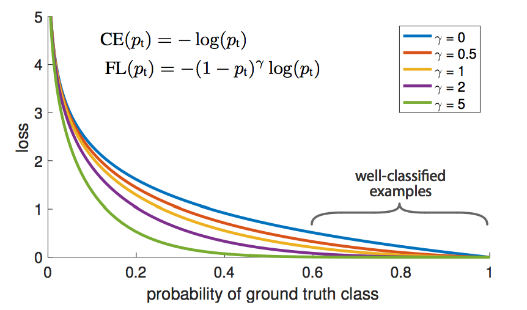

# Focal Loss for Dense Object Detection in PyTorch

Article: [Focal Loss for Dense Object Detection](https://arxiv.org/pdf/1708.02002.pdf)

The code is based on [this blog](https://blog.csdn.net/Code_Mart/article/details/89736187?ops_request_misc=%257B%2522request%255Fid%2522%253A%2522159348500019724835848610%2522%252C%2522scm%2522%253A%252220140713.130102334.pc%255Fall.%2522%257D&request_id=159348500019724835848610&biz_id=0&utm_medium=distribute.pc_search_result.none-task-blog-2~all~first_rank_ecpm_v3~pc_rank_v3-4-89736187.first_rank_ecpm_v3_pc_rank_v3&utm_term=focalloss+%E5%AE%9E%E7%8E%B0).

